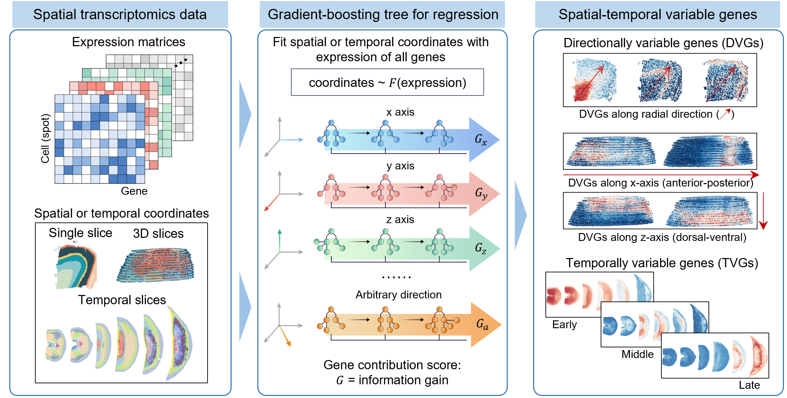

# STAVAG

## Overview
STAVAG is a method that identify directionally variable genes (DVGs) and temporally variable genes (TVGs) from spatial transcriptomics (ST) data. It is a unified gradient-boosting framework that models spatial-temporal information to uncover biological meaningful DVGs and TVGs.



## Prerequisites
It is recommended to use a Python version  `3.9`.
* set up conda environment for STAVAG:
```
conda create -n STAVAG python==3.9
```
* install STAVAG from shell:
```
conda activate STAVAG
```

* the important Python packages used to run the model are as follows: 
```
scanpy>=1.9.1
```

## Tutorials
The following are detailed tutorials. Move STAVAG into the Tutorials folder, and you’ll be able to run all the tutorials. All tutorials were ran on a 12600kf cpu.

1. [Identify DVGs on 2D cSCC data](./Tutorials/Case_I_STAVAG_on_2D_cSCC_data.ipynb).

2. [Identify DVGs on 3D planarian data](./Tutorials/Case_II_STAVAG_on_3D_planarian_data.ipynb).

3. [Identify DVGs on 3D cortex data along radial direction](./Tutorials/Case_III_STAVAG_on_STARmap_3D_cortex.ipynb).

4. [Identify TVGs on mouse myocardial infarction progression data](./Tutorials/Case_IV_STAVAG_on_mouse_myocardial_infarction_progression_data.ipynb).

5. [Identify TVGs on mouse embryonic development data](./Tutorials/Case_V_STAVAG_on_mouse_embryonic_development_data.ipynb).
