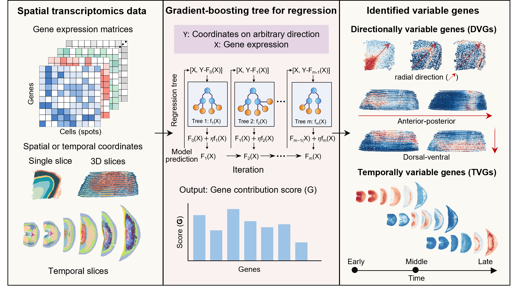

# STAVAG

## Overview
STAVAG is a method that identify directionally variable genes (DVGs) and temporally variable genes (TVGs) from spatial transcriptomics (ST) data. It is a unified gradient-boosting framework that models spatial-temporal information to uncover biological meaningful DVGs and TVGs.


For detailed usage, please refer to [STAVAG-Documentation](https://stavag-tutorial.readthedocs.io/en/latest/index.html).

## Prerequisites
It is recommended to use a Python version  `3.9`.
* set up conda environment for STAVAG:
```
conda create -n STAVAG python==3.9
```
* activate STAVAG from shell:
```
conda activate STAVAG
```

* you can install the important Python packages used to run the model are as follows: 
```
pip install scanpy[leiden]
pip install lightgbm
pip install scikit-learn
pip install scipy
```
The model was developed and tested using Scanpy (version 1.12), LightGBM (version 4.6.0), scikit-learn (version 1.7.2), and SciPy (version 1.15.3). The code is not strictly dependent on these exact package versions, and minor version variations are not expected to substantially affect the functionality or results of STAVAG.

* now you can install the STAVAG Python package as follows:
```
pip install STAVAG
```
The entire installation process should be completed within 5 minutes on a standard desktop computer.
